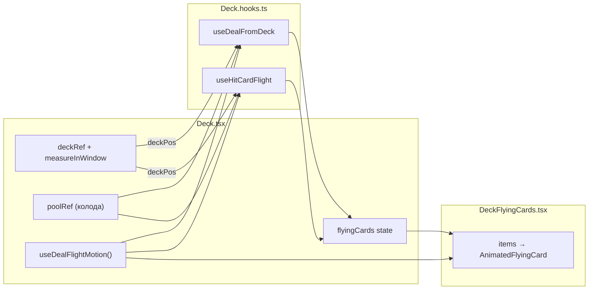
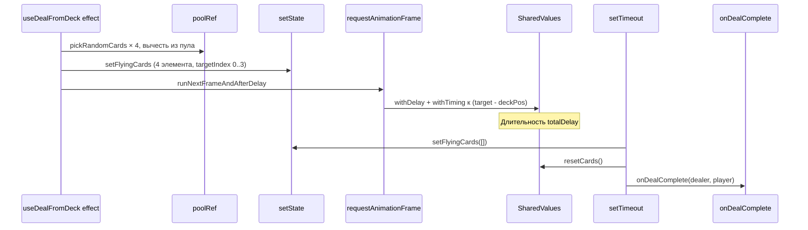
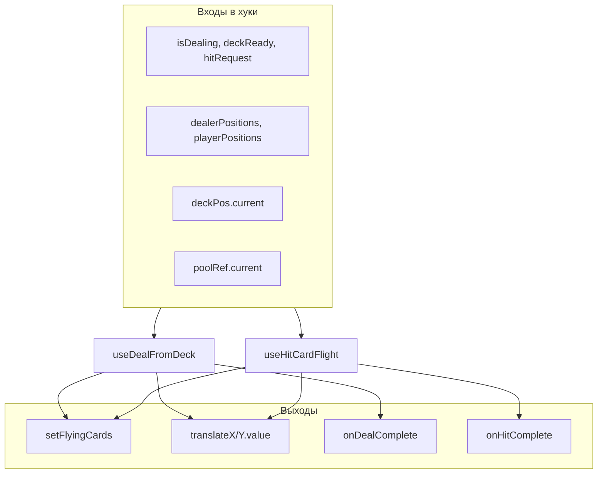

# `Deck.hooks.ts` — разбор

Файл связывает **состояние игры** (колода, раздача, hit), **измерения экрана** (где колода и слоты руки) и **анимацию Reanimated** (полёт карт). Компоненты `Deck.tsx` / `Hand.tsx` в основном про **верстку**; хуки — про **оркестрацию**: когда что запускать, в каких координатах, с какой очисткой.

## Роль каждого хука

| Хук | Назначение |
|-----|------------|
| `useDealFlightMotion` | Держит **стабильные** `SharedValue` для смещения до **4** летающих карт + `reset()`. |
| `useDealFromDeck` | `useEffect`: при старте раздачи берёт карты из пула, рисует «летающие», анимирует к слотам дилера/игрока, по окончании вызывает `onDealComplete`. |
| `useHitCardFlight` | `useEffect`: при `hitRequest` летит **одна** карта в нужный слот; по окончании `onHitComplete`. |

Связка с UI:

---

## 1. `useDealFlightMotion`

### Зачем отдельный хук

`SharedValue` из Reanimated должны **жить дольше одного эффекта** и не пересоздаваться на каждый рендер. Здесь восемь значений (4 карты × X/Y), но в массивах для раздачи используются **четыре пары** X/Y — по числу `flyingCardCount` (4).

### Стабильность ссылок

`useRef([...]).current` — **один раз** при монтировании фиксирует массив указателей на `SharedValue`. Эффекты могут безопасно брать `translateXRefs[i]` из зависимостей: ссылка на массив не меняется.

### `deckTopCardOriginInset`

Совпадает с визуальным «верхом» стопки (`stackCard3`: `deckStackOffset * 2`). Летающая карта в `DeckFlyingCards` позиционируется так же, как верхняя карта колоды — при `(0,0)` она совпадает с точкой старта; дальше анимация задаёт **смещение** до цели.

### `reset`

Обнуляет смещения первых `flyingCardCount` индексов к `deckTopCardOriginInset`, чтобы следующий полёт начинался из той же геометрической точки.

---

## 2. `useDealFromDeck` — раздача

### Условия входа в эффект

- `isDealing && deckReady`
- У дилера и игрока измерено не меньше `defaultHandSlotCount` позиций (2+2=4 цели под `flyingCardCount: 4`)

Иначе эффект **ничего не делает** (ранний `return`).

### Порядок шагов (высокий уровень)

### Координаты: экран vs «локально к колоде»

`Hand` (или родитель) отдаёт **абсолютные** координаты слотов (`measureInWindow`). Колода тоже измеряется в окно → `deckPos`.

Цель анимации:

`targetX = targets[i].x - deckPos.current.x` (и аналогично Y),

потому что летающая карта в `DeckFlyingCards` **якорится** к тому же `left`/`top`, что и колода (`deckLeftInset`, `50%` и т.д.). Смещение `translateX/Y` — это **вектор от верхней карты колоды до слота** в той же системе отсчёта.

### Зачем `runNextFrameAndAfterDelay` (helpers)

1. **Следующий кадр** — успеть применить `setFlyingCards` и смонтировать `AnimatedFlyingCard`, чтобы Reanimated «увидел» стартовые значения перед назначением `withTiming`.
2. **`setTimeout` на `totalDelay`** — колбэк после того, как **все** отложенные анимации закончились:  
   `totalDelay = flyingCardCount * sequenceInterval + animDuration`  
   (последняя карта стартует с задержкой `(n-1)*interval` и ещё идёт `duration`).

### Раздача по слотам

`targets` = первые 2 позиции дилера + первые 2 игрока → `picked[0..1]` дилер, `[2..3]` игрок. `targetIndex` в `DeckFlyingCardItem` сопоставляется с `translateXRefs[targetIndex]` в `DeckFlyingCardsList`.

### Cleanup

`return () => clearFlightScheduling(scheduling)` отменяет RAF и таймер, если эффект **перезапустился** или компонент размонтировался до конца — иначе возможны утечки и вызовы на размонтированном дереве.

### Зависимости `useEffect`

В массиве — и примитивы, и **refs** (`poolRef`, `uniqueId`, `deckPos`). Для refs это нормально: их **идентичность** стабильна; эффект всё равно перечитывает `.current` внутри. Важнее: при смене `dealerPositions` / `playerPositions` / флагов пересчитывается траектория.

---

## 3. `useHitCardFlight` — добор карты

### Отличия от раздачи

| | Раздача | Hit |
|--|--------|-----|
| Триггер | `isDealing` + `deckReady` | `hitRequest != null` + `deckReady` + **не** `isDealing` |
| Карт | 4 | 1 |
| Слот | Фиксированные индексы 0–3 | `resolveSlotPosition(..., hitRequest.slotIndex, ...)` |
| Канал motion | все `0..flyingCardCount-1` | только `[0]` для X/Y |
| После полёта | `resetCards()` целиком | ручной сброс `translateXRefs[0]` / `[0]` |

Hit **намеренно** использует **первый** канал анимации (`targetIndex: 0`), чтобы не конфликтовать с четырьмя каналами раздачи и упростить одну карту.

### `resolveSlotPosition`

Если для слота ещё нет измеренной позиции, координата **экстраполируется** по шагу между последними известными слотами (или по `cardWidth + rowGap`), чтобы hit не ломался при расширении руки.

---

## 4. Связь `flyingCards` ↔ `SharedValue`

- **`items`** — что рисовать (ранг/масть) и **какой** `SharedValue` слушать (`targetIndex`).
- **Сами числа анимации** живут в хуке motion; список только подписывает `useAnimatedStyle` на нужные `SharedValue`.

Итоговая схема данных:

---

## 5. Почему это кажется «лесом»

1. **Два мира состояния**: React state (`flyingCards`) + Reanimated (`SharedValue`) — разные причины перерисовки и разный timing.
2. **Асинхронность**: layout → `deckReady`, RAF → старт твинов, timeout → финальный колбэк.
3. **Эффекты как сценарии**: много императивных шагов в одном `useEffect`; без схемы легко потерять порядок.
4. **Refs в зависимостях**: неочевидно, что важна не «реактивность ref», а перезапуск при смене позиций/флагов.

---

## 6. Замечания по корректности (для понимания)

- Если `onDealComplete` / `onHitComplete` не мемоизированы в родителе, эффект может **перезапускаться** чаще, чем ожидается — стоит держать в голове при отладке.
- Одновременно активны оба эффекта, но hit заблокирован `isDealing`, что снижает гонки с раздачей.
